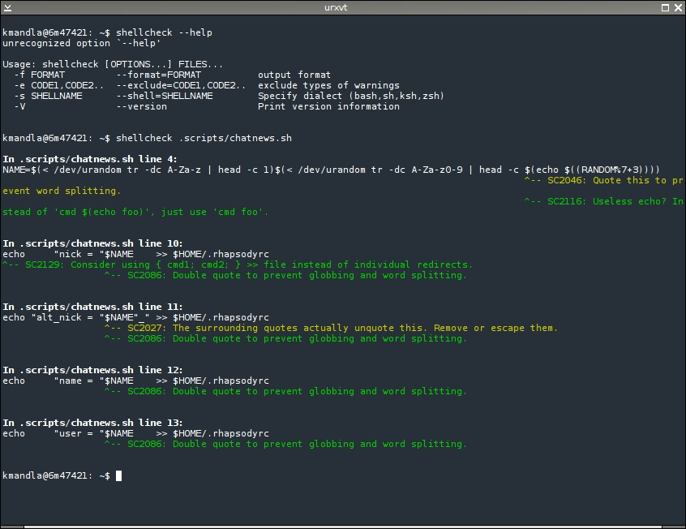
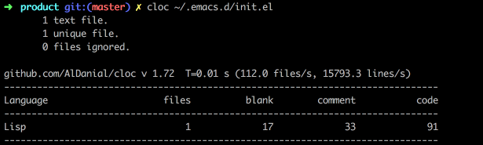
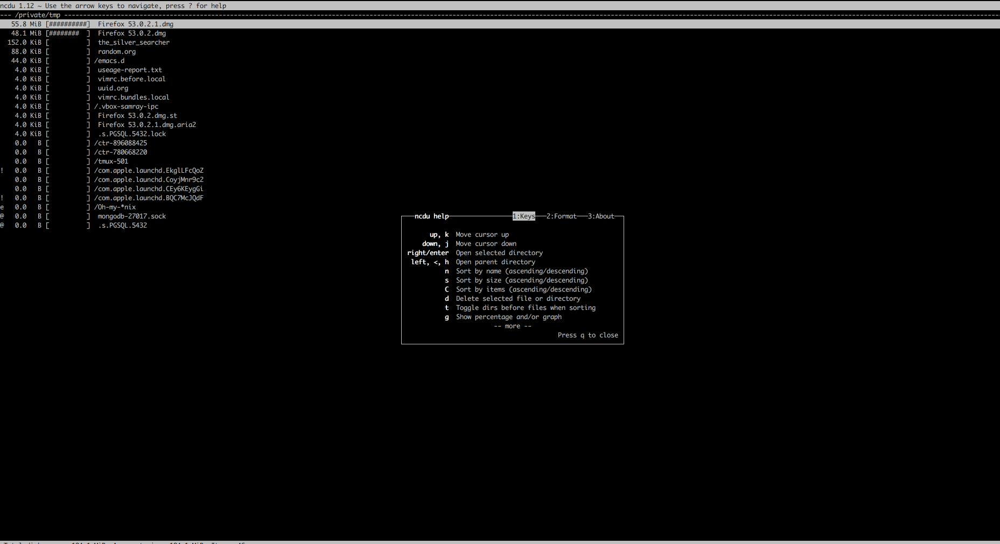

# Awesome common line tools

## Install

One script to install all awesome cli tools.

``` shell
curl -L https://raw.githubusercontent.com/ramsayleung/dotfiles/master/install_awesome_tool.sh |sh
```

## command line tools list[wip]

Even though Linux and Mac both are derived from Unix, but there are some tools which are special for linux, others is all available in Mac/Linux.

### iotop[linux special]

[Iotop](http://guichaz.free.fr/iotop/) is top like utilty but for disk I/O rather than process. It could show you the real-time disk I/O situation. Screenshot:


### tldr

[Tldr](http://tldr-pages.github.io/) is a simplified and community-driven man pages. The document of command in Unix is awesome, but perhaps you find it too verbose to read (just like me). Then, tldr will save your life. Tldr means "too long, don't read", it could simply the man pages. Screenshot:


### bat

### exa

### fd

### fzf

### tmux

### emacs

[Emacs](https://www.gnu.org/software/emacs/) is one of the two most famous editors.

### vim

[Vim](http://www.vim.org/) is other of the two most famous editors.
Screenshot:


### htop

[Htop](http://hisham.hm/htop/) is an iteractive process viewer for Unix systems which is simliar to *top* command, but much better and has more features.

Screenshot:


### ripgrep

[Ripgrep](https://github.com/BurntSushi/ripgrep) combines the usablity of The Silver Searcher with the raw speed of grep. It is the fastest code-search tool now, it faster than ag, ack, git grep, grep, and etc. Screenshot:


### httpie

[Httpie](https://httpie.org/) is a modern command line HTTP client &#x2013;user-friendly curl alternative with intuitive UI, JSON support, syntax highlighting, wget-like downloads, extensions,etc. Screenshot:


### tree

[Tree](https://linux.die.net/man/1/tree) could list contents of directory in a tree-like format Screenshot:


### shellcheck

[Shellcheck](https://github.com/koalaman/shellcheck) is a static analysis tool for shell scirpts, it so so so useful to help you check your shellscript. It also could be integrate with Vim/Emacs, so sweet. Screenshot:



### aria2c

[Aria2](https://aria2.github.io/) is a lightweight multi-protocol & multi-source command=line download utility which is similiar to axel, but has more features and a little bit slower than axel (just a little bit, in my opinion). It supports HTTP, HTTPS, FTP, SFTP, BitTorrent and Metalink. Moreover arai2 can also be manipulated via built-in JSON-RPC and XML-RPC interface. Because I care download speed so much, so my first choice is axel, but some urls could not be downloaded by axel, I will switch to aria2. Screenshot:


### jq

[Jq](https://github.com/stedolan/jq) is like *sed* for JSON data - you can use it to slice and filter and map and transform structured data with the same ease that *sed*, *awk*, *grep* and friends let you play with text. Screenshot:


### tokei

[Tokei](https://github.com/XAMPPRocky/tokei) is a program that displays statistics about your code. Tokei will show number of files, total lines within those files and code, comments, and blanks grouped by language, similar with [`cloc`](https://github.com/AlDanial/cloc), but much faster. Screenshot:


### mosh

[Mosh](https://mosh.org/) is a replacement for SSH, It is more robust and responsive, especially over Wi-Fi, cellular, and long-distance. Although I am still using SSH, but
when I am in a poor network, mosh is a better alternaive than SSH.

### proxychains-ng

[Proxychains-ng](https://github.com/rofl0r/proxychains-ng) is a powerful, new-generation preloader in terminal. It could hide your command like curl, wget behind socks/http proxies. If you are a programmre from China, you could find it so useful.

### ncdu

[Ncdu](https://dev.yorhel.nl/ncdu) is a disk usage analyzer with an ncurses interface.It is designed to find space hogs on a remote server where you don't have an entire graphical setup available, but it is a useful tool even on regular desktop systems.In my opinion, It is the best command line disk usage analyzer I ever used. Screenshot:


