# Awesome common line tools

## Install

One script to install all awesome cli tools.

``` shell
curl -L https://raw.githubusercontent.com/ramsayleung/dotfiles/master/install_awesome_tool.sh |sh
```

## command line tools list[wip]

Even though Linux and Mac both are derived from Unix, but there are some tools which are special for linux, others is all available in Mac/Linux.

### tldr

[Tldr](http://tldr-pages.github.io/) is a simplified and community-driven man pages. The document of command in Unix is awesome, but perhaps you find it too verbose to read (just like me). Then, tldr will save your life. Tldr means "too long, don't read", it could simply the man pages. Screenshot:


### aupa/z

This [little script](https://github.com/rupa/z) tracks the most frequently used directories along with the frequency, and then it let me jump to a directory by typing a partial path. For example, I have been to `~/code/cpp/jdk10` before, when I want to get to `~/code/cpp/jdk10` again, I could just type `z jdk10`, and then hit <kbd>Enter</kbd>. Screenshot:
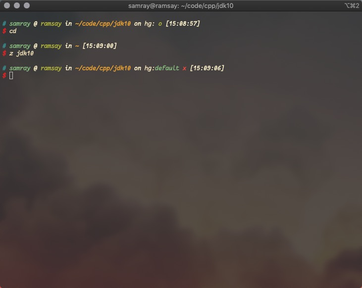

### bat

Have you ever thought of how `cat` is a bit boring when we are talking about syntax highlighting. Wouldn't it be nice if it was able to highlight the syntax of a file that it's printing out? [`bat`](https://github.com/sharkdp/bat) is absolutely what you want, which supports syntax highlighting for a large number of programming and markup languages.

| 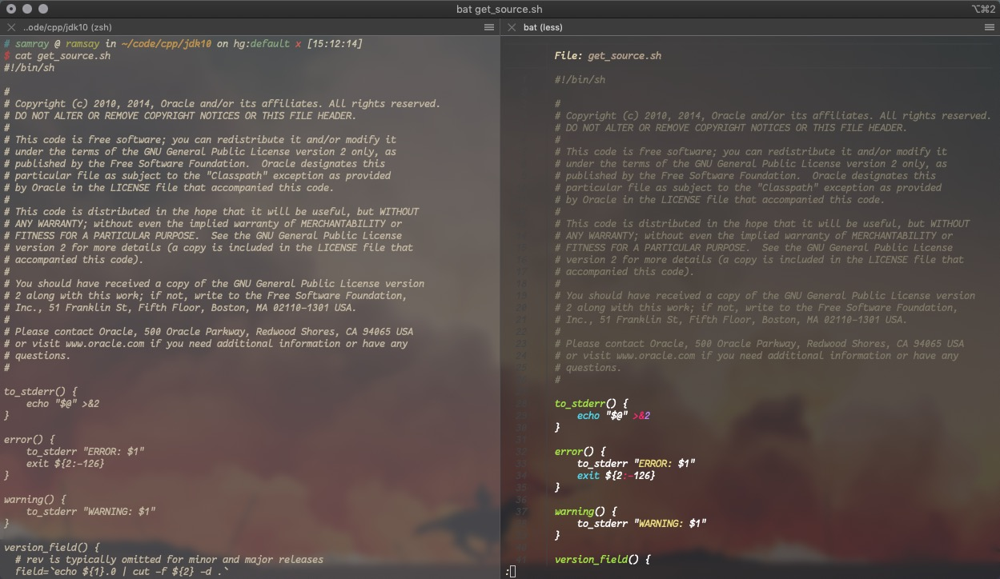|
|:-: |
| `cat` vs `bat` |

### exa

Just like `bat`, [`exa`](https://github.com/ogham/exa) is a modern replacement for the command-line program `ls` that ships with Unix and Linux operating systems, with more features and better defaults. Screenshot:
| 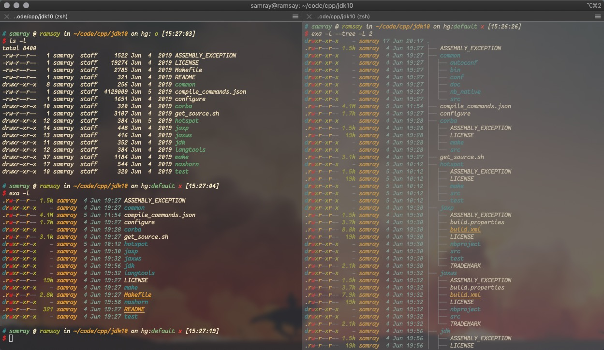|
|:-: |
| `ls` vs `exa` |

### fd

Well, you probably already figured out that there is a replacement for some built-in commands, now it is [`fd`](https://github.com/sharkdp/fd), which is a faster, easy-to-use alternative to `find`. 


### fzf

[`fzf`](https://github.com/junegunn/fzf) is a general-purpose command-line fuzzy finder, which is an interctive Unix filter for command-line that can be used with any list; files, command history, processes, hostnames, git commits, etc. Screenshot:

| 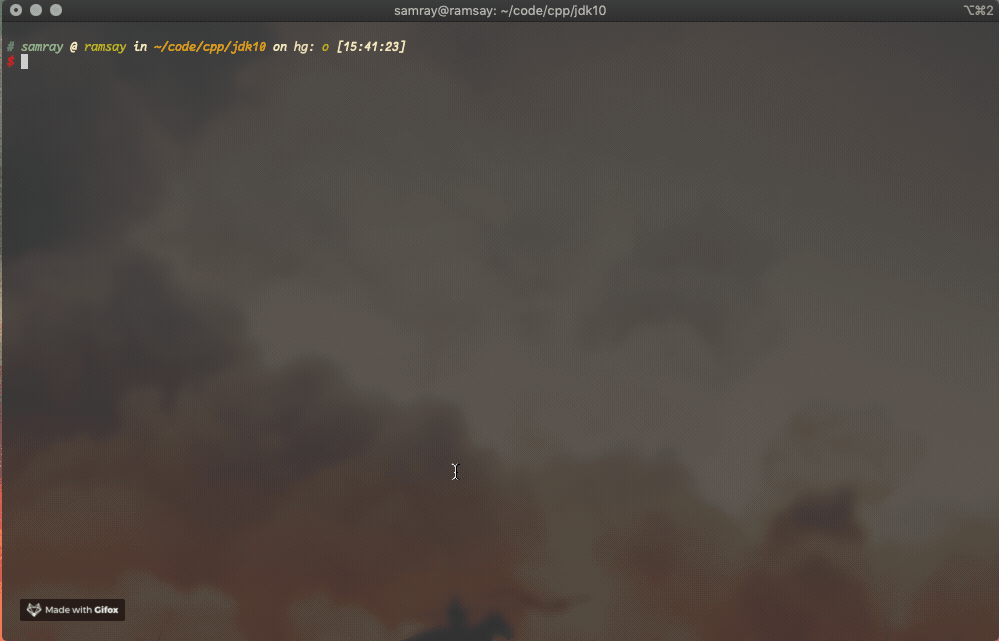|
|:-: |
|use `fzf` to filter command history|

### tmux
[`tmux`](https://github.com/tmux/tmux) is a terminal multiplexer for Unix-like operating systems. It allows multiple terminal sessions to be accessed simultaneously in a single window. It is useful for running more than one command-line program at the same time. Screenshot:

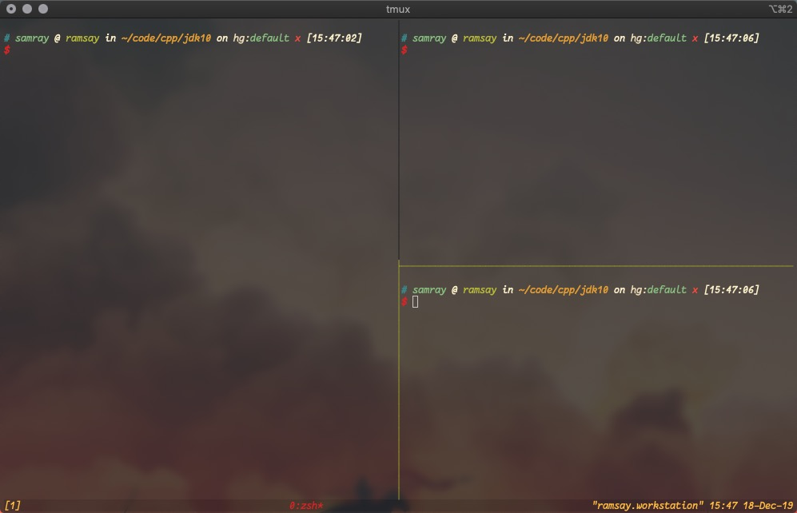

### ripgrep

[Ripgrep](https://github.com/BurntSushi/ripgrep) combines the usablity of The Silver Searcher with the raw speed of grep. It is the fastest code-search tool now, it faster than ag, ack, git grep, grep, and etc. Screenshot:


### emacs

[Emacs](https://www.gnu.org/software/emacs/) is one of the two most famous editors and this is my personal favourite. Screenshot:

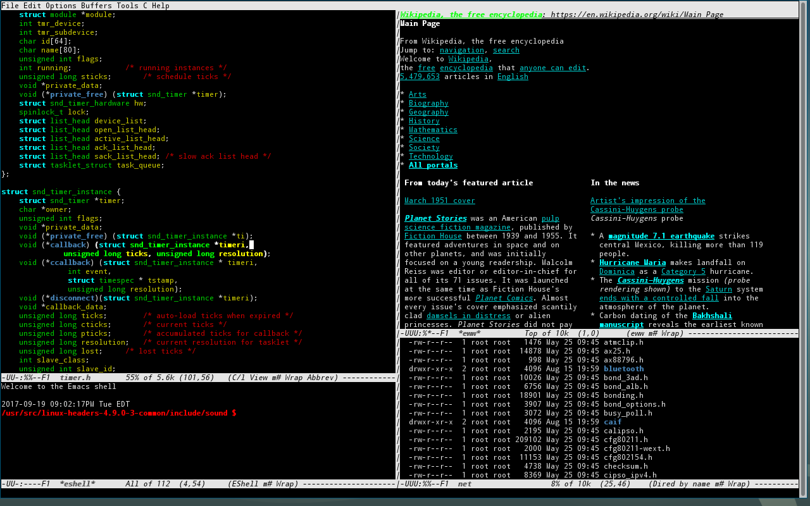

### vim

[Vim](http://www.vim.org/) is other of the two most famous editors.
Screenshot:


### htop

[Htop](http://hisham.hm/htop/) is an iteractive process viewer for Unix systems which is simliar to *top* command, but much better and has more features.

Screenshot:


### httpie

[Httpie](https://httpie.org/) is a modern command line HTTP client &#x2013;user-friendly curl alternative with intuitive UI, JSON support, syntax highlighting, wget-like downloads, extensions,etc. Screenshot:


### tree

[Tree](https://linux.die.net/man/1/tree) could list contents of directory in a tree-like format Screenshot:

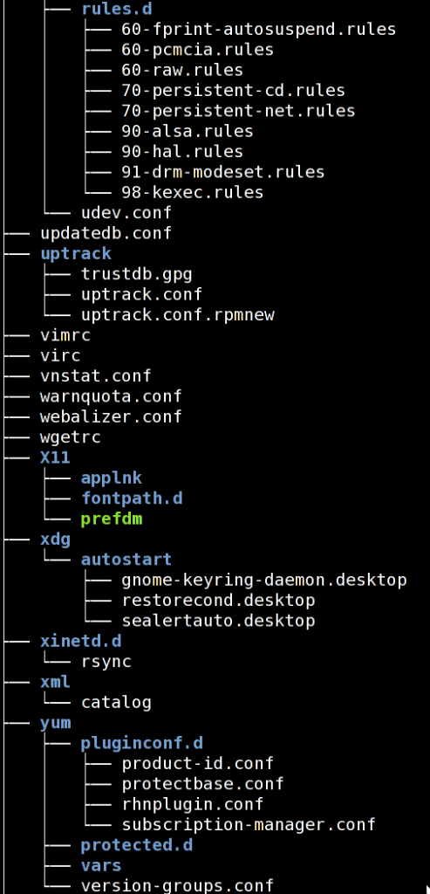

### shellcheck

[Shellcheck](https://github.com/koalaman/shellcheck) is a static analysis tool for shell scirpts, it so so so useful to help you check your shellscript. It also could be integrate with Vim/Emacs, so sweet. Screenshot:


### aria2c

[Aria2](https://aria2.github.io/) is a lightweight multi-protocol & multi-source command=line download utility which is similiar to axel, but has more features and a little bit slower than axel (just a little bit, in my opinion). It supports HTTP, HTTPS, FTP, SFTP, BitTorrent and Metalink. Moreover arai2 can also be manipulated via built-in JSON-RPC and XML-RPC interface. Because I care download speed so much, so my first choice is axel, but some urls could not be downloaded by axel, I will switch to aria2. Screenshot:
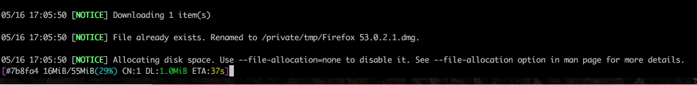

### jq

[Jq](https://github.com/stedolan/jq) is like *sed* for JSON data - you can use it to slice and filter and map and transform structured data with the same ease that *sed*, *awk*, *grep* and friends let you play with text. Screenshot:
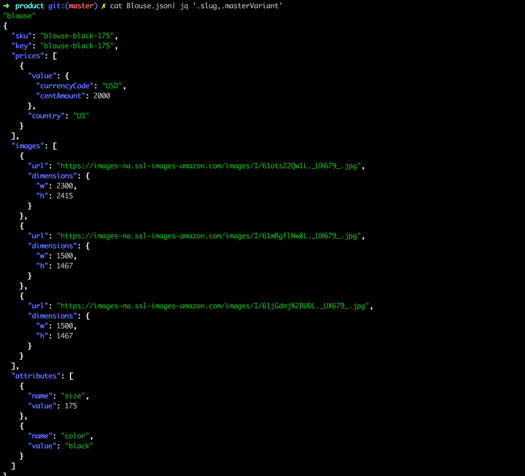

### tokei

[Tokei](https://github.com/XAMPPRocky/tokei) is a program that displays statistics about your code. Tokei will show number of files, total lines within those files and code, comments, and blanks grouped by language, similar with [`cloc`](https://github.com/AlDanial/cloc), but much faster. Screenshot:


### mosh

[Mosh](https://mosh.org/) is a replacement for SSH, It is more robust and responsive, especially over Wi-Fi, cellular, and long-distance. Although I am still using SSH, but
when I am in a poor network, mosh is a better alternaive than SSH.

### proxychains-ng

[Proxychains-ng](https://github.com/rofl0r/proxychains-ng) is a powerful, new-generation preloader in terminal. It could hide your command like curl, wget behind socks/http proxies. If you are a programmre from China, you could find it so useful. Screenshot:
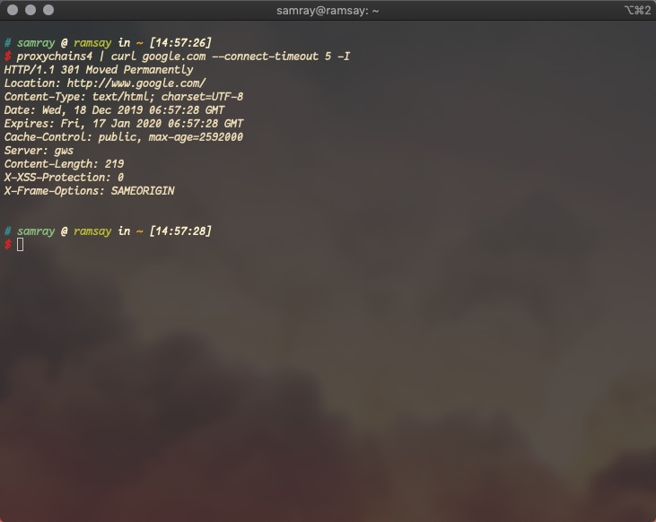

### ncdu

[Ncdu](https://dev.yorhel.nl/ncdu) is a disk usage analyzer with an ncurses interface(which means `du` with NCurses support).It is designed to find space hogs on a remote server where you don't have an entire graphical setup available, but it is a useful tool even on regular desktop systems.In my opinion, It is the best command line disk usage analyzer I ever used. Screenshot:

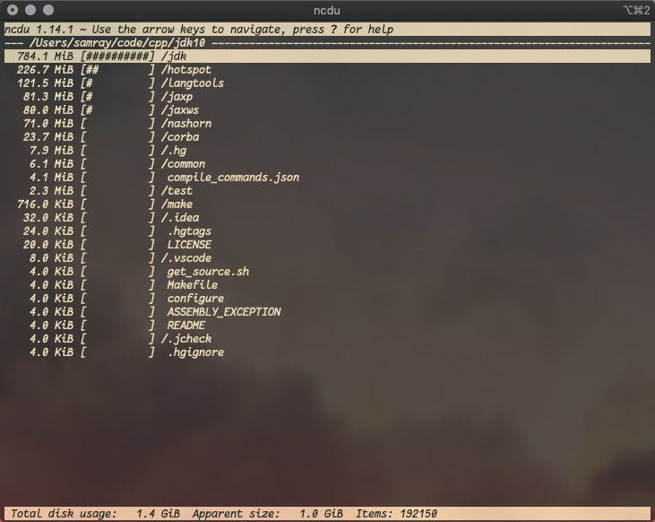

### iotop[linux special]

[Iotop](http://guichaz.free.fr/iotop/) is top like utilty but for disk I/O rather than process. It could show you the real-time disk I/O situation. Screenshot:

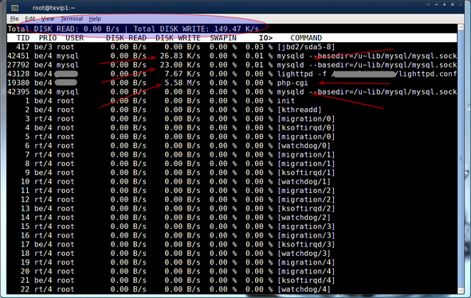
